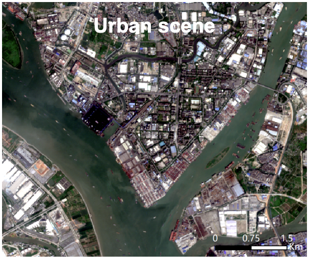
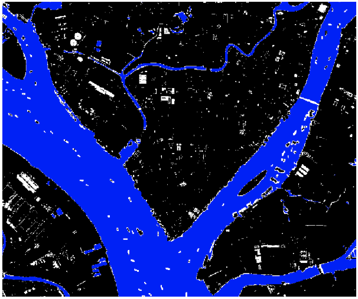
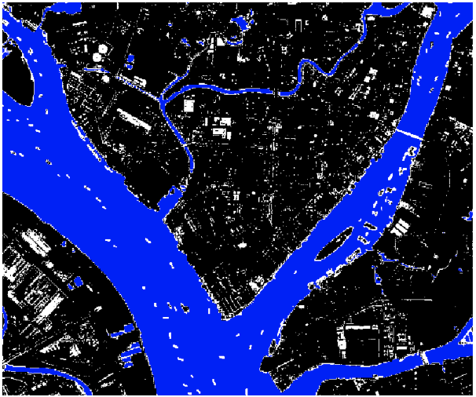
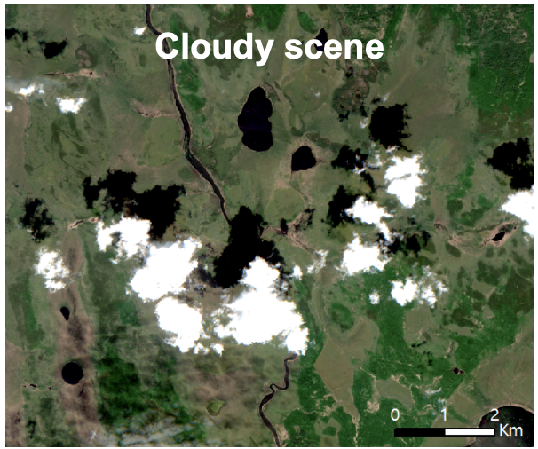
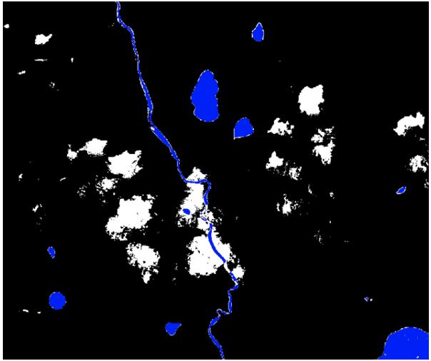
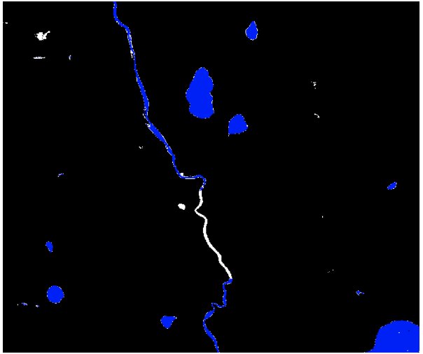
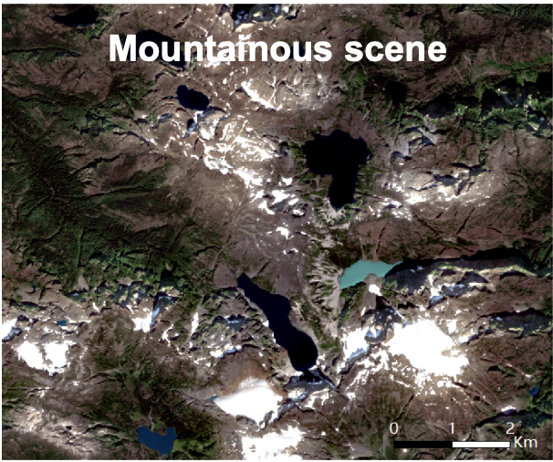
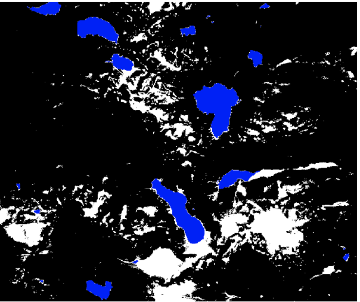
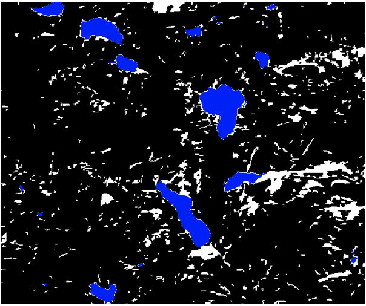
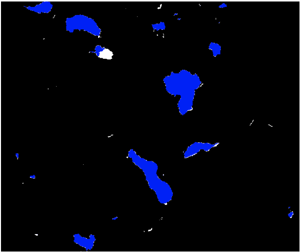

# -- WatNet
A deep ConvNet for surface water mapping based on Sentinel-2 image


# -- WatSet
- Surface water dataset for Deep learning could be downloaded from:  
[Google Drive](https://drive.google.com/drive/folders/1f8HPAe2wBUga-ImiYnFxaGlHGzvMDKF4?usp=sharing) and [Baidu Drive](https://pan.baidu.com/s/1V-k3me1gT0ph4kRmNrDnIw) (Fetch Code: uic2)  


<div align="left">

</div>

|Labeling example 1:|Labeling example 2:|
| :-- | :-- |
| | |

# -- performance
- Examples for surface water mapping  
  **Urban region**  
  <!-- <div align="left">
  
  
  
  
  </div> -->
  |||||  
  |--|--|--|--|  
  |||||


  **Cloudy region**  
  <!-- <div align="left">
  
  
  
  
  </div> -->
  |||||  
  |--|--|--|--|  
  |||||


  **Mountainous region**  
  <!-- <div align="left">
  
  
  
   -->
  <!-- </div> -->
  |||||  
  |--|--|--|--|  
  |||||


## **-- How to use the trained WatNet?**

### -- Step 1
- Enter the following commands for downloading the code files, and then configure the python and deep learning environment. The deep learning software used in this repo is [Tensorflow 2](https://www.tensorflow.org/).

  ~~~console
  git clone https://github.com/xinluo2018/WatNet.git
  ~~~

### -- Step 2
- Download Sentinel-2 images, and select four visible-near infrared 10-m bands and two 20-m shortwave infrared bands, which corresponding to the band number of 2, 3, 4, 8, 11, and 12 of sentinel-2 image.

### -- Step 3
- Add the prepared sentinel-2 image (6 bands) to the **_data/test-demo_** directory, modify the data name in the **_notebooks/infer_demo.ipynb_** file, then running the code file: **_notebooks/infer_demo.ipynb_** and surface water map can be generated. 
- Users also can specify the program for surface water mapping by using the watnet_infer.py, specifically,  
- --- funtional API:

```python
   from watnet_infer import watnet_infer   
   water_map = watnet_infer(rsimg)  # full example in notebooks/infer_demo.ipynb.
```
- --- command line API:
  ~~~console
  python watnet_infer.py data/test-demo/*.tif -o data/test-demo/result
  ~~~


## **-- How to train the WatNet?**

- With the Dataset (~will be released shortly), the user can train the WatNet through running the code file **_train/trainer.ipynb_**.  

## -- Acknowledgement  
We thanks the authors for providing some of the code in this repo:  
[deeplabv3_plus](https://github.com/luyanger1799/amazing-semantic-segmentation)  
[deepwatmapv2](https://github.com/isikdogan/deepwatermap)  

